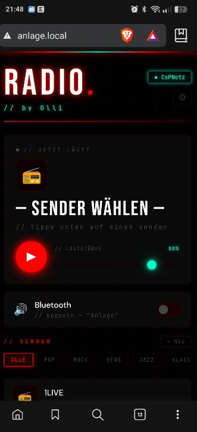
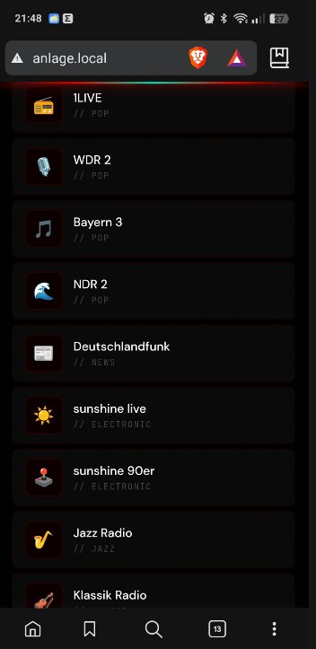
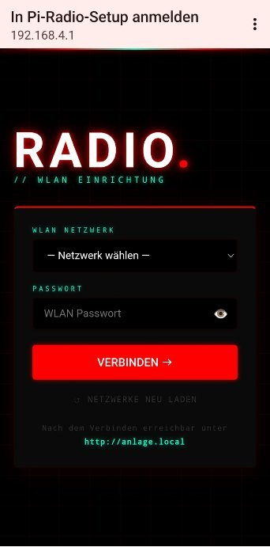
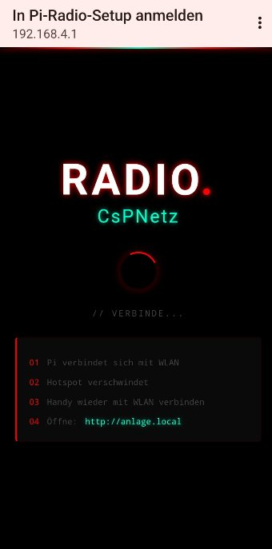

<div align="center">

# 📻 Pi Bluetooth WLAN Radio

### Ein selbst gebauter WLAN-Radio & Bluetooth-Streamer auf Basis des Raspberry Pi Zero 2W

[](https://github.com/GmhF3NiX)
[](https://www.raspberrypi.com)
[](https://flask.palletsprojects.com)
[](LICENSE)

---

   

*Neon Webinterface • Senderliste • WLAN Setup • Verbindungsseite*

</div>

---

## ✨ Features

| Feature | Beschreibung |
|---------|-------------|
| 🎵 **WLAN Webradio** | 11 vorinstallierte deutsche Sender |
| 📱 **Neon Webinterface** | Mobil-optimiert, Schwarz/Rot/Türkis Design |
| 🔊 **Bluetooth A2DP** | Handy direkt koppeln — kein PIN nötig |
| 📶 **Captive Portal** | WLAN-Setup über Hotspot `Pi-Radio-Setup` |
| 🔄 **Autostart** | Läuft sofort nach dem Booten |
| ➕ **Eigene Sender** | Hinzufügen & löschen über das Webinterface |
| 🎚️ **Lautstärke** | Regelbar über Slider im Webinterface |
| 🎸 **Genre Filter** | Pop, Rock, News, Jazz, Klassik, Electronic |
| 🌐 **Dual-Mode** | Gleichzeitig Hotspot (uap0) + WLAN Client (wlan0) |

---

## 🛒 Hardware

| Teil | Empfehlung | Preis |
|------|-----------|-------|
| 🖥️ Raspberry Pi Zero 2W | [Berrybase](https://www.berrybase.de) oder AliExpress | ~18€ |
| 🔊 USB-DAC | Tecknet USB Audio Adapter | ~5€ |
| 🔌 Micro-USB OTG Adapter | Beliebig | ~1€ |
| 💾 MicroSD Karte (16GB+) | Samsung oder SanDisk Class 10 | ~5€ |
| ⚡ USB Netzteil (5V/2A) | Altes Handy-Ladegerät | 0€ |
| **💰 Gesamt** | | **~29€** |

> 💡 **Tipp:** Den Pi Zero 2W gibt es bei [Berrybase.de](https://www.berrybase.de) für schnelle Lieferung in Deutschland!

---

## 🚀 Installation

### 1️⃣ SD Karte flashen

Lade den **[Raspberry Pi Imager](https://www.raspberrypi.com/software/)** herunter und flashe mit diesen Einstellungen:

```
OS:        Raspberry Pi OS Lite (64-bit)
Hostname:  anlage
SSH:       aktiviert
User:      pi (oder eigener Name)
Passwort:  (dein Wunschpasswort)
WLAN:      (dein Heimnetz)
Land:      DE
```

### 2️⃣ Per SSH verbinden

```bash
ssh pi@anlage.local
```

### 3️⃣ System updaten

```bash
sudo apt update && sudo apt upgrade -y
```

### 4️⃣ Pi Radio installieren — **Ein Befehl!**

```bash
curl -sSL https://raw.githubusercontent.com/GmhF3NiX/Pi-Bluetooth-Wlan-Radio/main/install.sh | sudo bash
```

### 5️⃣ Neu starten

```bash
sudo reboot
```

**Das war's!** 🎉

---

## 📱 Benutzung

### WLAN einrichten (Erststart)

```
1. Pi bootet → Hotspot "Pi-Radio-Setup" erscheint
2. Handy mit "Pi-Radio-Setup" verbinden
3. Browser öffnet Setup-Seite automatisch
4. WLAN + Passwort eingeben → VERBINDEN →
5. Pi verbindet sich → http://anlage.local öffnen
```

### Radio hören

```
Browser öffnen: http://anlage.local
Sender antippen → Musik läuft!
```

### Bluetooth nutzen

```
1. Webinterface → Bluetooth Toggle aktivieren
2. Auf Handy nach "Anlage" suchen
3. Koppeln → Musik vom Handy streamen
4. Toggle ausschalten → zurück zu WLAN Radio
```

### WLAN wechseln (z.B. auf Arbeit)

```
Webinterface → ⚙ Einstellungen → WLAN RESET
→ Hotspot "Pi-Radio-Setup" startet
→ Neues WLAN eingeben
```

---

## 📡 Vorinstallierte Sender

| Sender | Genre |
|--------|-------|
| 📻 1LIVE | Pop |
| 🎙️ WDR 2 | Pop |
| 🎵 Bayern 3 | Pop |
| 🌊 NDR 2 | Pop |
| 📰 Deutschlandfunk | News |
| ☀️ sunshine live | Electronic |
| 🕹️ sunshine 90er | Electronic |
| 🎷 Jazz Radio | Jazz |
| 🎻 Klassik Radio | Klassik |
| 🤘 Radio Bob | Rock |
| 🤘 Radio Bob *(wollte der Pimmelkopf)* | Rock |

> ➕ Eigene Sender können jederzeit über das Webinterface hinzugefügt werden!

---

## 🔧 Technologie

```
┌─────────────────────────────────────────┐
│         Pi Bluetooth WLAN Radio          │
├─────────────────────────────────────────┤
│  Web UI    │ Flask + Jinja2              │
│  Audio     │ mpg123                      │
│  Hotspot   │ hostapd + dnsmasq + uap0    │
│  WLAN      │ NetworkManager + nmcli      │
│  Bluetooth │ bluez + bt-agent            │
│  Audio I/O │ ALSA + PulseAudio           │
│  mDNS      │ avahi-daemon                │
└─────────────────────────────────────────┘
```

---

## 📁 Projektstruktur

```
Pi-Bluetooth-Wlan-Radio/
├── install.sh              # Komplettes Install-Script
├── radio.py                # Flask Webserver & Logik
├── templates/
│   ├── radio.html          # Hauptseite (Neon UI)
│   ├── setup.html          # WLAN Setup Seite
│   └── connecting.html     # Verbindungsseite
├── scripts/
│   ├── start-hotspot.sh    # Hotspot starten
│   ├── stop-hotspot.sh     # Hotspot stoppen
│   └── check-wifi.sh       # WLAN beim Boot prüfen
├── docs/
│   └── screenshot*.png     # Screenshots
└── README.md
```

---

## ⚡ Dual-WLAN Modus

Der Pi Zero 2W hat nur **einen WLAN-Chip** — trotzdem können wir gleichzeitig:
- Mit deinem WLAN verbunden sein (`wlan0`)
- Einen Hotspot betreiben (`uap0`)

Das funktioniert durch einen **virtuellen WLAN-Adapter** (`uap0`) der auf dem gleichen Chip läuft. So bleibt SSH immer erreichbar während der Hotspot läuft!

---

## 🐛 Bekannte Probleme & Lösungen

| Problem | Lösung |
|---------|--------|
| Kein Ton | USB-DAC prüfen: `aplay -l` |
| Hotspot erscheint nicht | `sudo systemctl restart uap0` |
| Bluetooth findet Pi nicht | `sudo rfkill unblock bluetooth && sudo hciconfig hci0 up` |
| uap0 hat keine IP | `sudo ip addr add 192.168.4.1/24 dev uap0` |

---

## 📝 Lizenz

MIT License — mach damit was du willst! 🤘

---

<div align="center">

**Made with ❤️ and 🤘 by Olli**

*Wochenlang debuggt, damit du es in 5 Minuten installieren kannst.*

[](https://github.com/GmhF3NiX/Pi-Bluetooth-Wlan-Radio/stargazers)

</div>

---

<div align="center">

## ☕ Support

Wenn dir das Projekt gefällt und du mich unterstützen möchtest:

[](https://paypal.me/rapidr3dde)

**Danke! 🤘**

</div>
